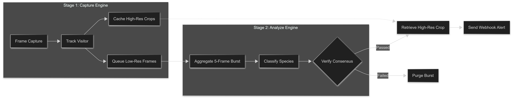
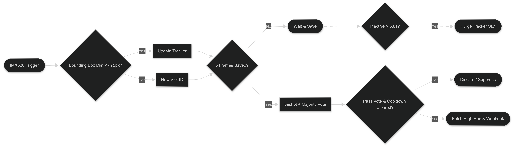

# 🐦 BirdCam: Dual-Stage Edge Bird Detection

A real-time bird monitoring, tracking, and species identification system designed for edge hardware. BirdCam uses a decoupled, asynchronous processing pipeline to achieve reliable object detection and species classification without causing CPU bottlenecks on constrained devices like the Raspberry Pi.

## 🚀 System Architecture

Traditional edge AI pipelines struggle with CPU lockups when capturing high-resolution video and running complex deep learning models concurrently. Additionally, deploying a custom-trained, multi-class species model directly to the Raspberry Pi AI Camera (Sony IMX500) is often impossible due to strict onboard memory limits and restricted neural network operator support. 

BirdCam resolves these hardware constraints by dividing the computer vision workload into two distinct stages:

### The Dual-Model Pipeline

1. **Stage 1: Primary Detection (On-Chip IMX500 YOLO)**
   * **[imx500_network_yolo11n_pp.rpk](imx500_network_yolo11n_pp.rpk):** Utilizes the standard pre-trained [YOLO11n](https://docs.ultralytics.com/models/yolo11/) architecture, compiled specifically for the Sony [IMX500](https://github.com/raspberrypi/imx500-models) hardware acceleration layer via the repository binary.
   * **Function:** Low-latency object localization.
   * **Execution:** Runs natively on the AI Camera's dedicated hardware processor (`.rpk` format). It performs a single, lightweight task: detecting a generic "bird" class. By avoiding complex multi-species classification, it maintains high frame rates and near-zero host CPU overhead. By using the default YOLO11 models, the system leverages a mature architecture trained on massive, generalized datasets (such as COCO). Because these pre-trained foundation models are incredibly robust at broad object detection, it is highly unlikely a custom-trained model would outperform this baseline at the basic task of locating a generic "bird," making it the ideal frontline trigger.

3. **Stage 2: Species Classification (Host Node PyTorch)**
   * **[best.pt](best.pt):** Uses a custom-trained [YOLO11n](https://docs.ultralytics.com/models/yolo11/) object detection model fine-tuned on the specialized [NABirds dataset](https://dl.allaboutbirds.org/nabirds) for precise avian variant categorization.
   * **Function:** Deep-dive classification and validation.
   * **Execution:** Runs asynchronously on a designated host or secondary node (e.g., Pi Zero 2 W) using a custom PyTorch model (`best.pt`). Because it processes isolated 5-frame burst datasets rather than ingesting a continuous live stream, per-frame processing time is no longer a critical bottleneck. This structural decoupling allows the host to run a significantly larger, parameter-dense, high-fidelity model loaded with specific avian classes. Trading the immediate time constraints of real-time video feeds for offline batch processing directly improves classification accuracy for complex, highly similar bird species.

## ⚙️ Installation & Setup

For complete, step-by-step instructions on configuring the hardware, installing dependencies, and flashing the Sony IMX500 firmware, please refer to the dedicated setup guide:

👉 **[Read the Installation Guide Here](installation.md)**

## Component Breakdown

The project's core logic is split into two specialized software layers: the Edge Processing Layer (responsible for computer vision and tracking) and the Cloud & Visualization Layer (responsible for storage, UI dashboards, and alert notifications).

### 📡 Edge Processing Layer

#### [capture.py](capture.py)
The frontend execution script is designed to run natively on the primary hardware capture node (Raspberry Pi equipped with the AI Camera). It bridges the hardware acceleration framework with low-latency software tracking loops.
* **Lossless Image Ingestion:** Pulls a pristine native configuration feed at **2028x1520** resolution directly via `Picamera2` layers.
* **Hardware Bounding-Box Parsing:** Monitors the IMX500's hardware metadata output registers to catch real-time localized target detections that exceed the confirmation threshold (`IMX_CONF_THRESHOLD = 0.40`).
* **Spatial Tracking Engines:** Maps target coordinate centroids frame-over-frame using a Euclidean distance algorithm (`SPATIAL_THRESHOLD = 475.0`). This creates persistent virtual "slots" that assign state metrics to individual bird arrivals.
* **Dual-Payload Burst:** Once a target slot registers an arrival, it enforces a strict 5-frame micro-burst window. For each frame, it saves two distinct image assets:
  1. A low-resolution (`640x640`) matrix optimized for rapid inference, saved directly to the classification pipeline (`queue/`).
  2. An untouched, box-free full-resolution crop with added bounding padding, saved to the local image cache (`highres_cache/`).
* **Automated Housekeeping:** Drops inactive slots instantly when a target leaves the detection zone after a short buffer loop (`GRACE_PERIOD = 5.0`).

#### [analyze.py](analyze.py)
An asynchronous processing background service engineered to sit cleanly on constrained edge hardware (such as a Raspberry Pi Zero 2 W or a host system container) without impacting camera frame rates.
* **Resource Optimization:** Limits PyTorch thread usage to a maximum of 2 parallel threads (`OMP_NUM_THREADS = 2`) to ensure that intense inference calls do not trigger network timeouts or OS kernel locks on low-tier CPUs.
* **Batch Assembly & Filtering:** Groups incoming frames inside the classification directory dynamically by their unique event tokens. It also filters out stale, incomplete frame sets older than 60 seconds.
* **Sequential Voting Consensus:** Pulls complete 5-frame batches and processes them sequentially using the custom species classification model (`best.pt`). It requires a clean majority vote (mode evaluation) across the frames to prevent edge blurs or fleeting shadows from triggering false positives.
* **Species Suppression Log:** References an adjustable global tracking log (`GLOBAL_COOLDOWN = 300.0`) per individual species, preventing repeat visitors from spamming web endpoints.
* **Payload Ingestion Handover:** After confirming a successful detection match, it pulls the matching pristine source asset from the high-res cache directory, names it using structured metadata (`YYYYMMDD_HHMMSS_Species.jpg`), cleans up temporary work directories, and initiates the remote transmission hook.

### 🌐 Cloud & Visualization Layer

#### [vps_app.py](vps_app.py)
A production-ready Flask server framework designed to be deployed on an external cloud server or virtual private server (VPS). It serves as an isolated bridge between your local home network environment and public notification platforms.
* **Multi-Part Webhook Processing:** Exposes a secure incoming receiver endpoint designed to catch large binary payloads and operational strings sent by the edge analysis loop.
* **Persistent Web Directory Storage:** Deconstructs the incoming payload stream to verify structural integrity, writing the verified target assets cleanly into local web directories (`./detections`) on the host.
* **Discord Downstream Relay:** Uses multi-part form requests to translate internal logging strings into Markdown alert cards. It then attaches the saved high-resolution binary image and forwards the packet to a secure Discord webhook endpoint.
* **Public Gallery UI Dashboard:** Renders an internal responsive grid view populated dynamically from the storage directory. It parses filenames chronologically and features built-in JavaScript image models to view high-resolution image crops.

#### [app.py](app.py)
An independent, zero-configuration local alternative to the cloud architecture script. It serves an identical web presentation layer without requiring external VPS servers or public IP mappings.
* **Local Network Binding:** Configures the underlying framework to bind cleanly to all available interfaces, making the web interface accessible to any machine connected to the local Wi-Fi network.
* **Direct Directory File Mapping:** Scans local output folders natively to track file changes. It automatically formats target dates and species labels straight from filenames, making it ideal for self-contained, offline setups.
